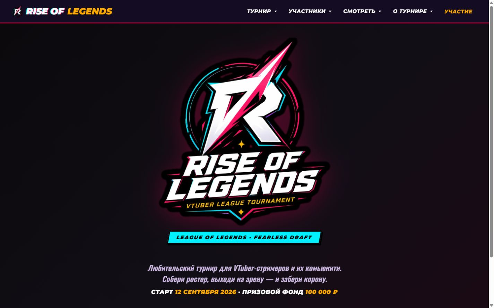

# Rise of Legends — Tournament Platform

> Public portfolio showcase for an active digital tournament platform.

Rise of Legends — действующая платформа для организации любительского турнира по League of Legends среди VTuber-стримеров и их сообществ.

[Открыть production-сайт](https://rise-of-legends.com/) · [Читать case study](CASE_STUDY.md) · [Посмотреть функции](FEATURES.md)

## О проекте

Платформа объединяет публичную турнирную витрину и рабочие инструменты участников и организаторов. Зрители получают актуальную информацию о событии, а капитаны, спикеры и администрация работают в отдельных ролевых сценариях.

Это showcase-репозиторий: он представляет продукт, задачи и результаты, но намеренно не публикует production-код, схему базы данных, внутренние API и эксплуатационные настройки.

## Ключевые возможности

- публичные страницы турнира, команд, расписания, трансляций и сетки;
- Twitch OAuth и разграничение пользовательских ролей;
- персональные одноразовые приглашения выбранным участникам;
- отдельные кабинеты капитана и спикера;
- управление составом и заявками игроков;
- административное управление турнирными данными;
- серии BO1, BO3 и BO5;
- автоматическое продвижение победителя по сетке;
- матч за третье место и аварийная корректировка результата;
- официальный email-контур приглашений и обращений организаторам;
- отдельная страница официальных контактов и действующих социальных каналов турнира;
- health-check, CI quality checks и production smoke-тесты.

## Моя роль

**Web Developer / Technical Administrator**

- развитие существующего production-приложения;
- диагностика и исправление функциональных проблем;
- проектирование пользовательских и административных сценариев;
- развитие модели данных и правил доступа;
- сопровождение email-интеграции;
- сборка, deployment, мониторинг и документация.

## Технологии

- Next.js 16;
- React 19;
- TypeScript 6;
- Supabase и PostgreSQL;
- Twitch OAuth;
- Row Level Security и серверные операции PostgreSQL;
- Resend;
- Ubuntu VPS, Node.js и PM2;
- GitHub Actions и Dependabot.

## Документы

- [Client Case Study](CASE_STUDY.md)
- [Features and User Value](FEATURES.md)
- [Technical Overview](TECHNICAL_OVERVIEW.md)
- [Project Timeline](PROJECT_TIMELINE.md)
- [Publication and Security Notes](SECURITY.md)
- [Production Screenshots](assets/screenshots/README.md)
- [Visual Assets Guide](assets/README.md)

## Статус

**Active production project.** Основные пользовательские, турнирные, административные и почтовые сценарии реализованы и работают на [rise-of-legends.com](https://rise-of-legends.com/).

## Repository scope

Полный production-репозиторий является приватным. Этот публичный showcase содержит только презентационные материалы и не предназначен для развёртывания приложения.
