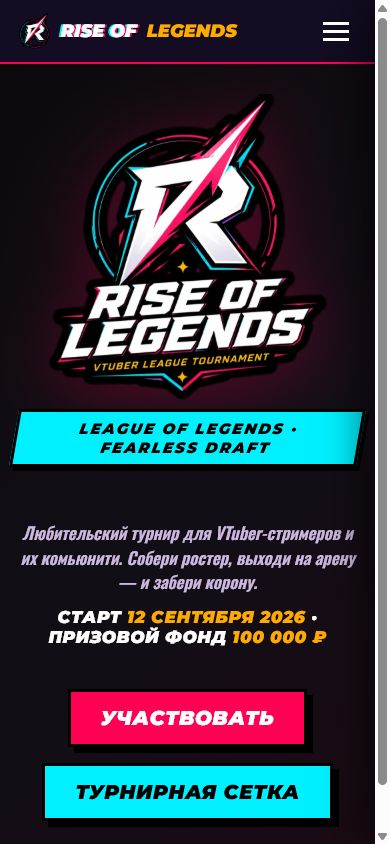
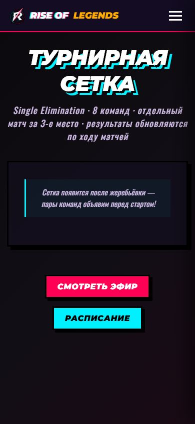
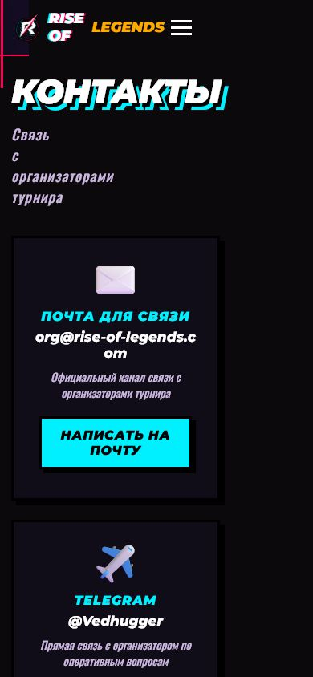

# Production Screenshots

Скриншоты сделаны 23 июля 2026 года на действующей версии [rise-of-legends.com](https://rise-of-legends.com/).

## Main presentation

### Главная страница — desktop

Показывает фирменный первый экран, позиционирование турнира, дату и призовой фонд.

### Главная страница — mobile

Показывает адаптивный первый экран, мобильную навигацию и основные действия.

## Tournament functionality

### Турнирная сетка — mobile

Показывает публичное состояние сетки до жеребьёвки. Реальные команды и результаты не подменяются демонстрационными данными.

## Official contacts

### Контакты — mobile

Показывает официальный адрес организаторов и прямой канал связи через Telegram.

## Awaiting safe source data

Следующие кадры будут добавлены после появления подходящих production-данных или безопасного тестового профиля:

- список и публичная карточка команды;
- заполненное расписание;
- результат матча и продвижение победителя;
- кабинеты капитана и спикера;
- административный интерфейс без заявителей, email и токенов;
- официальный email-макет без активного приглашения;
- зелёный CI без внутренних сведений приватного репозитория.

Фиктивные команды, результаты и закрытые пользовательские данные для заполнения галереи не используются.
